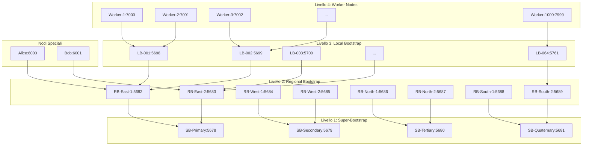
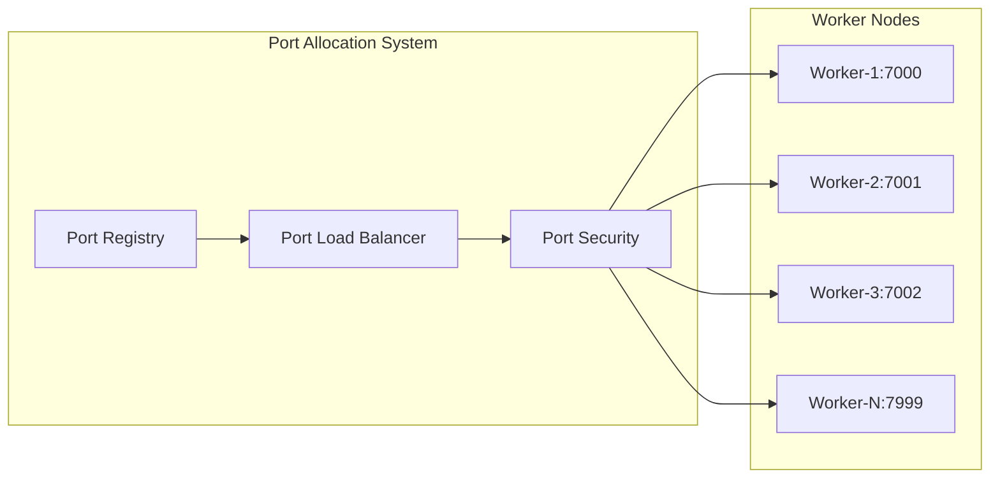
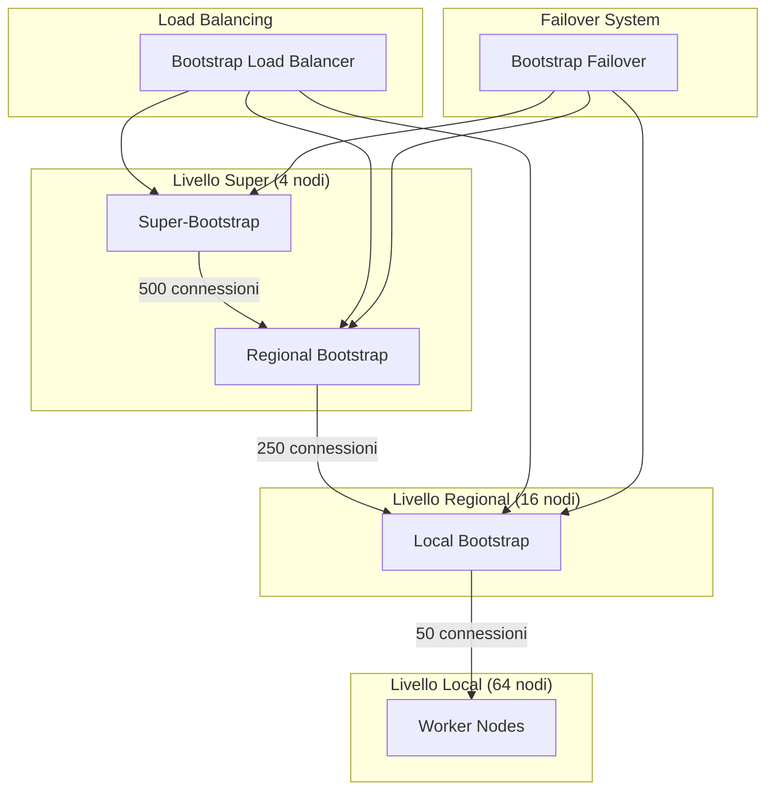
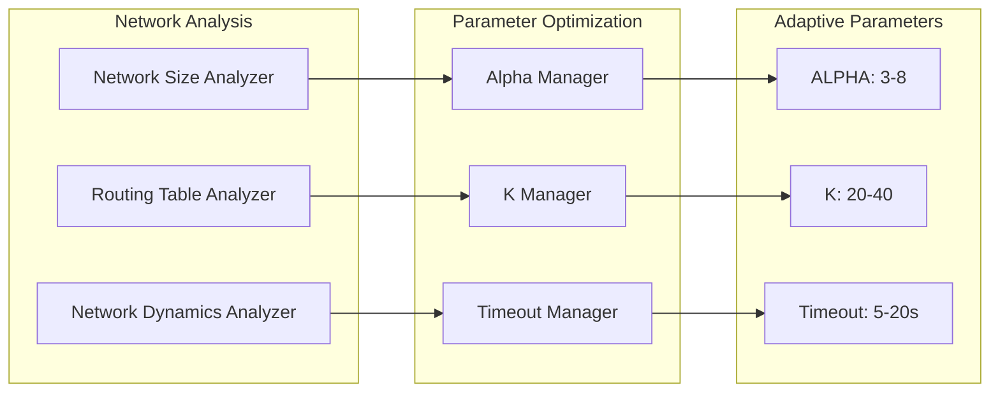
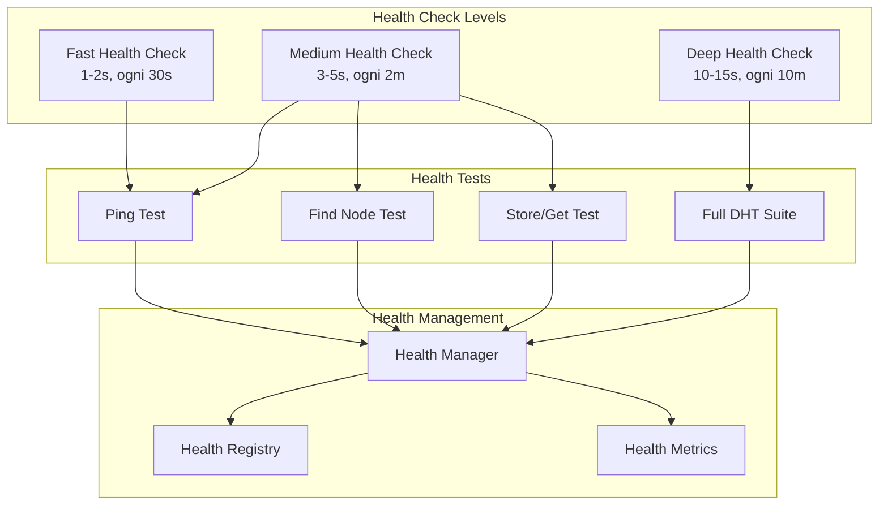
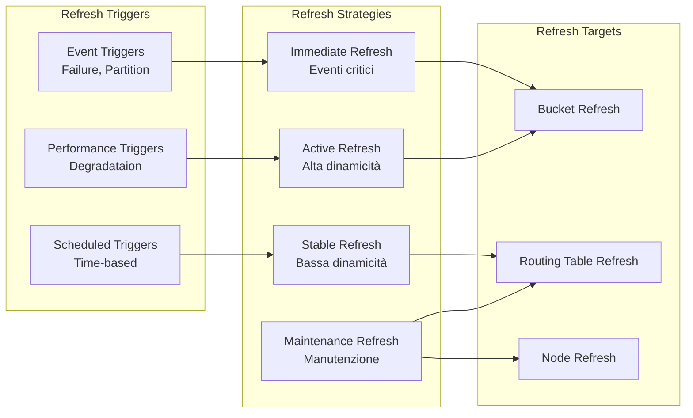
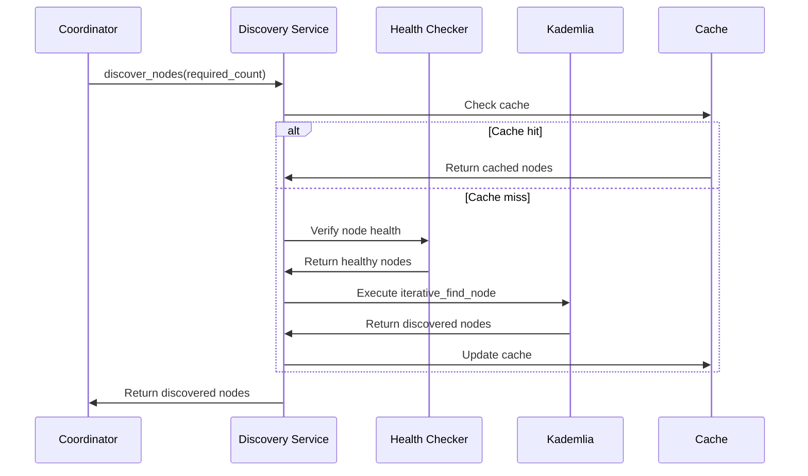
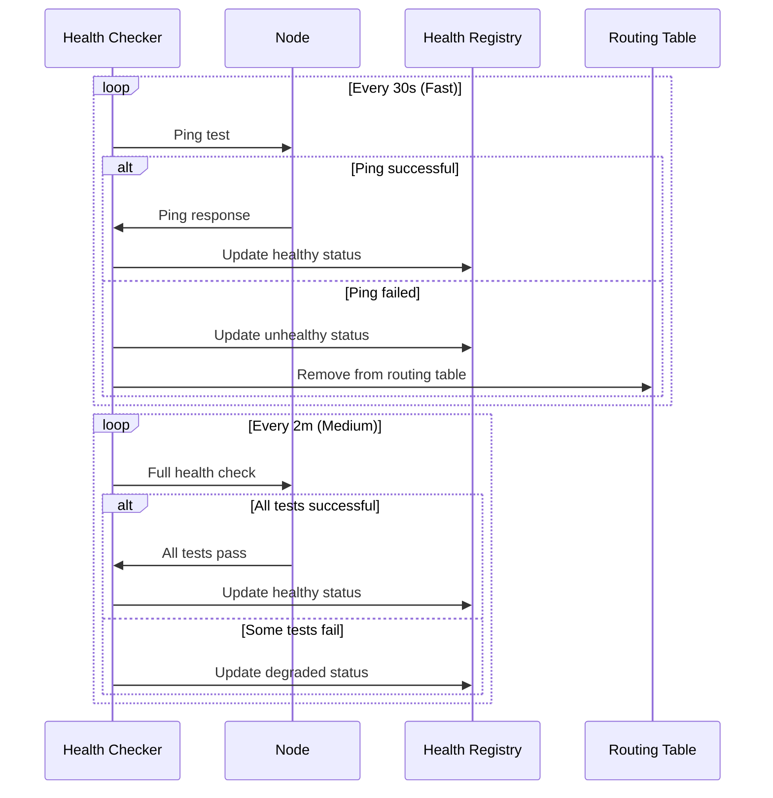
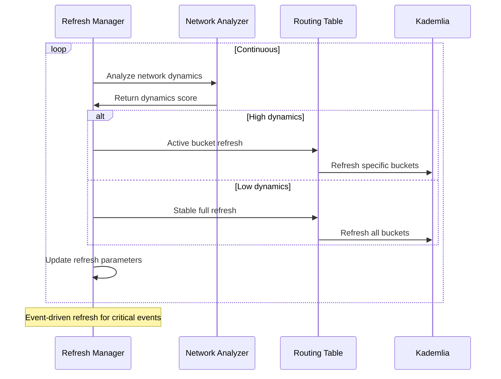
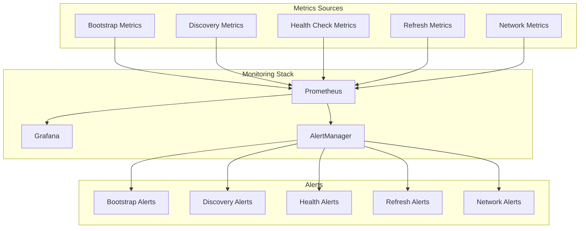

# Architettura Completa del Sistema CQKD Scalabile

## Overview

Documento completo dell'architettura del sistema CQKD ottimizzato per supportare 1000+ worker con performance elevate e affidabilità garantita.

## Architettura High-Level



## Componenti Principali

### 1. Sistema di Porte Dinamiche

#### Architettura


#### Caratteristiche
- **Range Porte**: 7000-7999 (1000 porte disponibili)
- **Allocazione Dinamica**: Assegnazione automatica porte uniche
- **Load Balancing**: Distribuzione uniforme carico
- **Conflict Resolution**: Gestione automatica conflitti
- **Security Policy**: Controllo accessi e isolamento

### 2. Architettura Bootstrap Multi-Livello

#### Topologia Gerarchica


#### Capacità per Livello
| Livello | Nodi | Capacità per Nodo | Capacità Totale |
|---------|-------|------------------|-----------------|
| Super | 4 | 500 connessioni | 2000 |
| Regional | 16 | 250 connessioni | 4000 |
| Local | 64 | 50 connessioni | 3200 |
| **Totale** | **84** | - | **9200** |

### 3. Parametri Kademlia Adattivi

#### Sistema Adattivo


#### Configurazioni per Dimensione Rete
| Dimensione | ALPHA | K | Timeout | Refresh |
|-----------|--------|---|---------|---------|
| 0-50 | 3 | 20 | 5.0s | 300s |
| 51-200 | 4 | 25 | 8.0s | 240s |
| 201-500 | 6 | 35 | 15.0s | 180s |
| 501-1000 | 8 | 40 | 20.0s | 120s |
| 1000+ | 8+ | 40+ | 20.0s+ | 60s |

### 4. Sistema Health Check

#### Architettura Gerarchica


#### Test per Livello
| Livello | Test | Timeout | Frequenza | Obiettivo |
|---------|------|---------|-----------|-----------|
| Fast | Ping | 1-2s | 30s | Verifica base connettività |
| Medium | Ping + Find Node + Store/Get | 3-5s | 2m | Verifica funzionalità DHT |
| Deep | Full DHT Suite | 10-15s | 10m | Diagnostica completa |

### 5. Sistema Refresh Adattivo

#### Architettura Event-Driven


#### Intervalli Adattivi
| Condizione | Tipo Refresh | Intervallo | Scope |
|------------|---------------|-------------|--------|
| Evento Critico | Immediato | 0s | Bucket affetti |
| Alta Dinamicità | Attivo | 30-60s | Bucket attivi |
| Media Dinamicità | Normale | 120-300s | Tutti bucket |
| Bassa Dinamicità | Manutenzione | 600-1800s | Routing table |

## Flussi Operativi

### 1. Bootstrap Flow

```mermaid
sequenceDiagram
    participant W as Worker
    participant LB as Load Balancer
    participant SB as Super-Bootstrap
    participant RB as Regional Bootstrap
    participant LB2 as Local Bootstrap
    
    W->>LB: Request bootstrap nodes
    LB->>LB: Analyze network load
    LB->>LB: Select optimal bootstrap
    LB->>W: Return bootstrap list
    
    W->>SB: Attempt bootstrap 1
    alt Bootstrap success
        SB->>W: Bootstrap successful
    else Bootstrap failed
        W->>RB: Attempt bootstrap 2
        alt Regional success
            RB->>W: Bootstrap successful
        else Regional failed
            W->>LB2: Attempt bootstrap 3
            LB2->>W: Bootstrap successful
    end
    
    W->>W: Start health check
    W->>W: Join DHT operations
```

### 2. Discovery Flow



### 3. Health Check Flow



### 4. Refresh Flow



## Configurazione di Sistema

### 1. Configurazione Principale

```python
# config.py - Settings complete
class Settings(BaseSettings):
    # === Porte Dinamiche ===
    enable_dynamic_ports: bool = True
    base_port: int = 7000
    max_port: int = 7999
    port_allocation_timeout: float = 10.0
    
    # === Bootstrap Multi-Livello ===
    enable_multi_level_bootstrap: bool = True
    super_bootstrap_nodes: List[str] = ["127.0.0.1:5678", "127.0.0.1:5679"]
    regional_bootstrap_count: int = 16
    local_bootstrap_count: int = 64
    
    # === Parametri Kademlia Adattivi ===
    enable_adaptive_kademlia: bool = True
    small_network_threshold: int = 50
    medium_network_threshold: int = 200
    large_network_threshold: int = 500
    xlarge_network_threshold: int = 1000
    
    # === Health Check ===
    enable_health_check: bool = True
    health_check_levels: List[str] = ["fast", "medium", "deep"]
    fast_check_interval: int = 30
    medium_check_interval: int = 120
    deep_check_interval: int = 600
    
    # === Refresh Adattivo ===
    enable_adaptive_refresh: bool = True
    refresh_optimization_interval: int = 300
    immediate_refresh_enabled: bool = True
    active_refresh_min_interval: int = 15
    stable_refresh_max_interval: int = 600
    
    # === Performance e Scalabilità ===
    target_nodes: int = 1000
    max_concurrent_operations: int = 1000
    performance_monitoring_enabled: bool = True
    
    # === Fallback e Compatibilità ===
    enable_fallback_mode: bool = True
    legacy_compatibility_mode: bool = False
    fallback_bootstrap_nodes: str = "127.0.0.1:5678,127.0.0.1:5679"
    fallback_static_port: int = 7000
```

### 2. Configurazione Docker Compose

```yaml
# docker-compose.scalable.yml
version: '3.8'

services:
  # === Super Bootstrap Nodes ===
  sb-primary:
    image: cqkd-dht-node:latest
    container_name: cqkd-sb-primary
    environment:
      - DHT_PORT=5678
      - NODE_ID=sb-primary
      - BOOTSTRAP_LEVEL=super
      - MAX_CONNECTIONS=500
      - ENABLE_DYNAMIC_PORTS=false
    ports:
      - "5678:5678/udp"
    networks:
      - cqkd-network
    command: ["python", "-m", "scripts.super_bootstrap_node"]
    deploy:
      resources:
        limits:
          memory: 512M
          cpus: '0.5'
        reservations:
          memory: 256M
          cpus: '0.25'

  sb-secondary:
    image: cqkd-dht-node:latest
    container_name: cqkd-sb-secondary
    environment:
      - DHT_PORT=5679
      - NODE_ID=sb-secondary
      - BOOTSTRAP_LEVEL=super
      - BOOTSTRAP_NODES=sb-primary:5678
      - MAX_CONNECTIONS=500
      - ENABLE_DYNAMIC_PORTS=false
    ports:
      - "5679:5679/udp"
    networks:
      - cqkd-network
    depends_on:
      sb-primary:
        condition: service_healthy
    command: ["python", "-m", "scripts.super_bootstrap_node"]

  # === Regional Bootstrap Nodes ===
  rb-east-1:
    image: cqkd-dht-node:latest
    container_name: cqkd-rb-east-1
    environment:
      - DHT_PORT=5682
      - NODE_ID=rb-east-1
      - BOOTSTRAP_LEVEL=regional
      - REGION=east
      - BOOTSTRAP_NODES=sb-primary:5678,sb-secondary:5679
      - MAX_CONNECTIONS=250
    ports:
      - "5682:5682/udp"
    networks:
      - cqkd-network
    depends_on:
      - sb-primary
      - sb-secondary
    command: ["python", "-m", "scripts.regional_bootstrap_node"]

  # === Worker Nodes (Template) ===
  worker:
    image: cqkd-dht-node:latest
    environment:
      - DHT_PORT=${DHT_PORT}  # Dinamico
      - WORKER_ID=${WORKER_ID}  # Dinamico
      - BOOTSTRAP_NODES=sb-primary:5678,sb-secondary:5679,rb-east-1:5682
      - ENABLE_DYNAMIC_PORTS=true
      - ENABLE_HEALTH_CHECK=true
      - ENABLE_ADAPTIVE_KADEMLIA=true
      - ENABLE_ADAPTIVE_REFRESH=true
    ports:
      - "${DHT_PORT}:${DHT_PORT}/udp"
    networks:
      - cqkd-network
    depends_on:
      sb-primary:
        condition: service_healthy
      sb-secondary:
        condition: service_healthy
    command: ["python", "-m", "scripts.worker_node"]
    deploy:
      resources:
        limits:
          memory: 256M
        reservations:
          memory: 128M

networks:
  cqkd-network:
    driver: bridge
    ipam:
      config:
        - subnet: 172.20.0.0/16
```

### 3. Script di Deployment

```bash
#!/bin/bash
# deploy_scalable_network.sh

# Configurazione
WORKER_COUNT=${1:-1000}
SUPER_BOOTSTRAP_COUNT=${2:-4}
REGIONAL_BOOTSTRAP_COUNT=${3:-16}
LOCAL_BOOTSTRAP_COUNT=${4:-64}

echo "Deploying CQKD scalable network:"
echo "  Workers: $WORKER_COUNT"
echo "  Super Bootstrap: $SUPER_BOOTSTRAP_COUNT"
echo "  Regional Bootstrap: $REGIONAL_BOOTSTRAP_COUNT"
echo "  Local Bootstrap: $LOCAL_BOOTSTRAP_COUNT"

# Genera docker-compose per worker
cat > docker-compose.workers.yml << EOF
version: '3.8'

services:
EOF

# Avvia super bootstrap
docker-compose -f docker-compose.scalable.yml up -d sb-primary sb-secondary

# Attendi super bootstrap
echo "Waiting for super bootstrap..."
sleep 30

# Avvia regional bootstrap
for i in $(seq 1 $REGIONAL_BOOTSTRAP_COUNT); do
    port=$((5681 + i))
    region_name=$(printf "region-%02d" $i)
    
    cat >> docker-compose.workers.yml << EOF
  rb-\$region_name:
    image: cqkd-dht-node:latest
    container_name: cqkd-rb-\$region_name
    environment:
      - DHT_PORT=$port
      - NODE_ID=rb-\$region_name
      - BOOTSTRAP_LEVEL=regional
      - REGION=\$region_name
      - BOOTSTRAP_NODES=sb-primary:5678,sb-secondary:5679
      - MAX_CONNECTIONS=250
    ports:
      - "$port:$port/udp"
    networks:
      - cqkd-network
    command: ["python", "-m", "scripts.regional_bootstrap_node"]

EOF
done

# Avvia regional bootstrap
docker-compose -f docker-compose.workers.yml up -d

# Attendi regional bootstrap
echo "Waiting for regional bootstrap..."
sleep 60

# Avvia worker
for i in $(seq 1 $WORKER_COUNT); do
    port=$((6999 + i))
    worker_id=$(printf "worker-%04d" $i)
    
    cat >> docker-compose.workers.yml << EOF
  worker-$i:
    image: cqkd-dht-node:latest
    container_name: cqkd-$worker_id
    environment:
      - DHT_PORT=$port
      - WORKER_ID=$i
      - BOOTSTRAP_NODES=sb-primary:5678,sb-secondary:5679
      - ENABLE_DYNAMIC_PORTS=true
      - ENABLE_HEALTH_CHECK=true
      - ENABLE_ADAPTIVE_KADEMLIA=true
      - ENABLE_ADAPTIVE_REFRESH=true
    ports:
      - "$port:$port/udp"
    networks:
      - cqkd-network
    command: ["python", "-m", "scripts.worker_node"]
    deploy:
      resources:
        limits:
          memory: 256M
        reservations:
          memory: 128M

EOF
done

# Avvia worker
docker-compose -f docker-compose.workers.yml up -d

echo "Deployment completed!"
echo "Super Bootstrap: http://localhost:5678"
echo "Regional Bootstrap: http://localhost:5682-5697"
echo "Workers: http://localhost:7000-7999"
```

## Metriche e Monitoraggio

### 1. Metriche di Performance

| Categoria | Metrica | Target | Threshold |
|-----------|----------|---------|------------|
| Bootstrap | Bootstrap Time | < 120s | > 180s |
| Discovery | Discovery Time | < 45s | > 60s |
| Health Check | Health Check Time | < 25s | > 30s |
| Refresh | Refresh Overhead | < 15% | > 20% |
| Network | Packet Loss | < 1% | > 5% |
| Network | Latency | < 100ms | > 500ms |

### 2. Metriche di Scalabilità

| Scale | Metrica | Target | Threshold |
|-------|----------|---------|------------|
| 15 nodes | Total Bootstrap | < 30s | > 45s |
| 50 nodes | Total Bootstrap | < 45s | > 60s |
| 200 nodes | Total Bootstrap | < 60s | > 90s |
| 500 nodes | Total Bootstrap | < 90s | > 120s |
| 1000 nodes | Total Bootstrap | < 120s | > 180s |

### 3. Dashboard di Monitoraggio



## Procedure Operative

### 1. Startup Procedure

```bash
# 1. Setup ambiente
./setup_environment.sh

# 2. Avvio monitoring
./start_monitoring.sh

# 3. Avvio bootstrap cluster
./deploy_bootstrap_cluster.sh

# 4. Verifica bootstrap
./verify_bootstrap_health.sh

# 5. Avvio worker
./deploy_workers.sh 1000

# 6. Verifica completa
./verify_network_health.sh
```

### 2. Shutdown Procedure

```bash
# 1. Stop worker
./stop_workers.sh

# 2. Attesa stabilizzazione
sleep 30

# 3. Stop regional bootstrap
./stop_regional_bootstrap.sh

# 4. Stop super bootstrap
./stop_super_bootstrap.sh

# 5. Cleanup
./cleanup_network.sh
```

### 3. Emergency Procedures

```bash
# 1. Rileva problema
./detect_network_issues.sh

# 2. Isola problema
./isolate_problematic_nodes.sh

# 3. Fallback mode
./enable_fallback_mode.sh

# 4. Recovery
./attempt_recovery.sh

# 5. Se recovery fallisce
./emergency_shutdown.sh
```

## Troubleshooting Guide

### 1. Problemi Comuni

#### Bootstrap Fallito
**Sintomi**: Worker non riescono a connettersi
**Cause**: 
- Bootstrap nodes non raggiungibili
- Porte bloccate
- Configurazione errata

**Soluzioni**:
```bash
# Verifica bootstrap nodes
docker ps | grep bootstrap

# Verifica connettività
telnet localhost 5678

# Controlla log
docker logs cqkd-sb-primary

# Riavvia bootstrap
docker-compose restart sb-primary
```

#### Port Conflicts
**Sintomi**: Worker non partono
**Cause**: 
- Porte già in uso
- Range porte esaurito
- Configurazione errata

**Soluzioni**:
```bash
# Verifica porte in uso
netstat -tulpn | grep :700

# Controlla allocazione porte
docker logs cqkd-worker-1 | grep "port"

# Estendi range porte
# Modifica config.py: max_port = 8999
```

#### Performance Degradation
**Sintomi**: Operazioni lente
**Cause**: 
- Parametri Kademlia non ottimali
- Health check troppo frequenti
- Refresh troppo aggressivo

**Soluzioni**:
```bash
# Analizza performance
./analyze_performance.sh

# Ottimizza parametri
./optimize_kademlia_params.sh

# Adjust health check
./adjust_health_check_interval.sh
```

### 2. Debug Tools

```bash
# Network diagnostics
./network_diagnostics.sh

# Routing table analysis
./analyze_routing_table.sh

# Health check verification
./verify_health_check.sh

# Performance profiling
./profile_performance.sh
```

## Security Considerations

### 1. Network Security
- **Firewall Rules**: Solo porte necessarie aperte
- **Network Segmentation**: Isolamento livelli bootstrap
- **Access Control**: Autenticazione nodi bootstrap
- **Encryption**: Comunicazioni crittografate

### 2. Container Security
- **Resource Limits**: CPU/memory limits per container
- **Image Security**: Scansione vulnerabilità
- **Runtime Protection**: Seccomp/AppArmor profiles
- **Network Policies**: Kubernetes NetworkPolicies

### 3. Data Security
- **Data Encryption**: DHT values crittografati
- **Access Control**: Autorizzazioni granulari
- **Audit Logging**: Log accessi e modifiche
- **Backup Procedures**: Backup configurazioni

## Future Enhancements

### 1. Short Term (3-6 mesi)
- **Auto-scaling**: Scaling automatico basato su carico
- **Advanced Monitoring**: ML-based anomaly detection
- **Performance Optimization**: JIT compilation
- **Security Hardening**: Zero-trust architecture

### 2. Long Term (6-12 mesi)
- **Multi-region**: Distribuzione geografica
- **Edge Computing**: Processing al bordo rete
- **Quantum Enhancements**: Integrazione protocolli quantistici
- **AI Operations**: Automated operations

## Conclusioni

L'architettura scalabile del sistema CQKD fornisce:

1. **Scalabilità**: Supporto 1000+ worker con performance ottimali
2. **Affidabilità**: Health check, failover, recovery automatici
3. **Efficienza**: Parametri adattivi, refresh ottimizzato
4. **Manutenibilità**: Monitoraggio completo, debugging tools
5. **Sicurezza**: Multi-livello security, encryption
6. **Compatibilità**: Fallback mode, legacy support

Il sistema è pronto per deployment in produzione con capacità di gestire scale enterprise mantenendo alta affidabilità e performance.