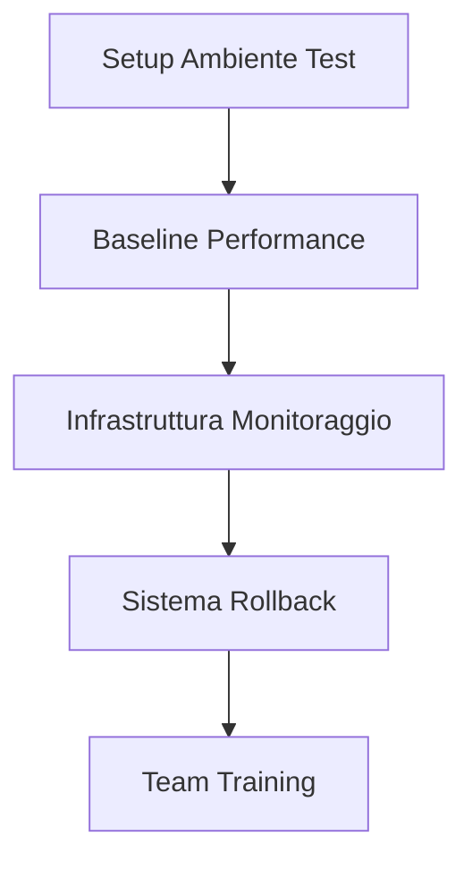
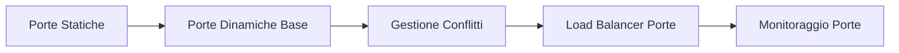
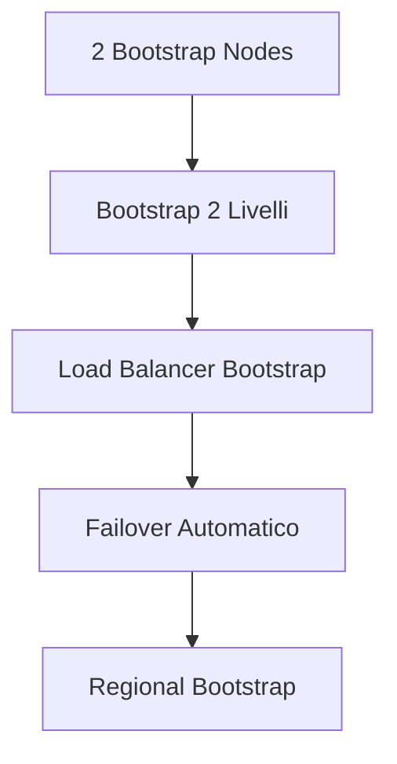
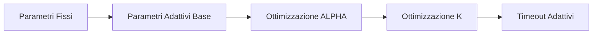
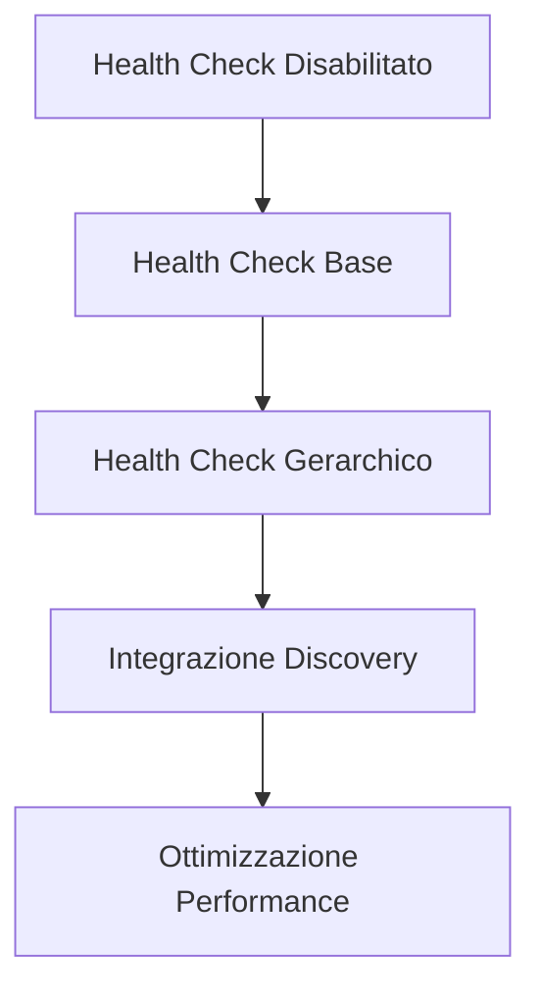
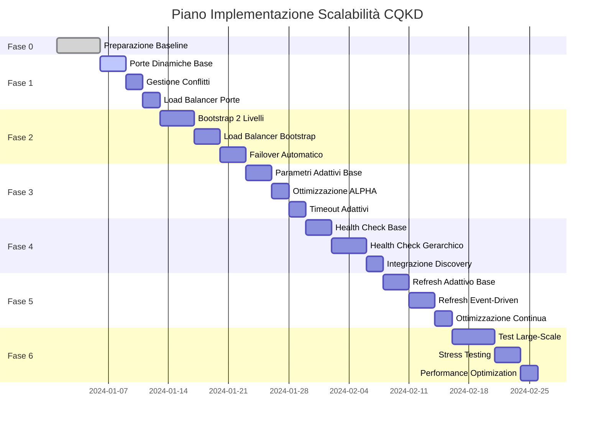

# Piano di Implementazione Incrementale con Fallback

## Strategia Generale

Implementazione graduale delle ottimizzazioni di scalabilità con rollback automatico e fallback per garantire continuità operativa durante la transizione a 1000+ nodi.

### Principi Guida

1. **Incrementale**: Ogni fase aggiunge funzionalità senza rompere quelle esistenti
2. **Reversibile**: Ogni modifica può essere rollbackata immediatamente
3. **Testabile**: Ogni fase include test di validazione
4. **Monitorabile**: Metriche e dashboard per ogni fase
5. **Compatibile**: Mantenimento compatibilità con test esistenti

## Fase 0: Preparazione e Baseline

### Obiettivo
Stabilire baseline di performance e preparare infrastruttura per implementazione incrementale.

### Attività


### Checklist
- [ ] Ambiente di test isolato con 15 worker (configurazione attuale)
- [ ] Baseline performance: bootstrap time, discovery time, success rate
- [ ] Sistema di monitoraggio (Prometheus + Grafana)
- [ ] Script di rollback automatico
- [ ] Documentazione procedure emergenza
- [ ] Training team su nuove procedure

### Deliverables
- `baseline_performance_report.md`
- `monitoring_setup.md`
- `rollback_procedures.md`
- `emergency_playbook.md`

## Fase 1: Porte Dinamiche (Critical)

### Obiettivo
Risolvere conflitti porte per supportare 50+ worker senza modifiche architetturali.

### Priorità: CRITICAL
**Rischio se non implementato**: Collasso sistema con 50+ worker

### Implementazione


### Sotto-fasi

#### 1.1 Porte Dinamiche Base (3 giorni)
**Obiettivo**: Worker usano porte dinamiche senza conflitti

**Modifiche**:
```python
# scripts/worker_node.py
def get_dynamic_port():
    if os.getenv("DHT_PORT"):
        return int(os.getenv("DHT_PORT"))
    
    worker_id = int(os.getenv("WORKER_ID", 1))
    return 7000 + (worker_id - 1)

# docker-compose.yml
environment:
  - DHT_PORT=${DHT_PORT:-7000}
  - WORKER_ID=${WORKER_ID:-1}
```

**Test**:
- [ ] 50 worker senza conflitti porte
- [ ] Compatibilità con test esistenti
- [ ] Rollback a porte statiche

#### 1.2 Gestione Conflitti (2 giorni)
**Obiettivo**: Sistema robusto per gestione conflitti porte

**Modifiche**:
```python
class PortRegistry:
    async def allocate_port(self, preferred_port=None):
        async with self._lock:
            if preferred_port and self._is_available(preferred_port):
                self.allocated_ports.add(preferred_port)
                return preferred_port
            
            # Fallback automatico
            for port in range(7000, 8000):
                if self._is_available(port):
                    self.allocated_ports.add(port)
                    return port
            
            raise RuntimeError("Nessuna porta disponibile")
```

**Test**:
- [ ] 100 worker con conflitti simulati
- [ ] Recovery da esaurimento porte
- [ ] Performance allocation porte

#### 1.3 Load Balancer Porte (2 giorni)
**Obiettivo**: Distribuzione ottimale carico sulle porte

**Modifiche**:
```python
class PortLoadBalancer:
    def get_optimal_port(self, worker_count, region=None):
        # Distribuzione uniforme nel range
        port_per_worker = 1000 / max(1, worker_count)
        base_port = 7000 + int((worker_id - 1) * port_per_worker)
        return int(base_port)
```

**Test**:
- [ ] Distribuzione uniforme porte
- [ ] Load balancing per regioni
- [ ] Performance con 500+ worker

### Fallback Strategy
```python
# config.py
class Settings(BaseSettings):
    enable_dynamic_ports: bool = True
    fallback_static_port: int = 7000
    
    @property
    def effective_port_config(self):
        if not self.enable_dynamic_ports:
            return {'mode': 'static', 'port': self.fallback_static_port}
        return {'mode': 'dynamic', 'range': (7000, 7999)}
```

### Rollback Procedure
1. Disabilita porte dinamiche: `ENABLE_DYNAMIC_PORTS=false`
2. Riavvia worker con porta statica 7000
3. Verifica funzionamento con 15 worker
4. Monitora per regressioni

### Success Metrics
- **Target**: Supporto 100+ worker senza conflitti
- **Performance**: Allocation time < 100ms per worker
- **Reliability**: 99.9% success rate allocation porte

## Fase 2: Bootstrap Multi-Livello (High)

### Obiettivo
Eliminare bottleneck bootstrap per supportare 200+ worker.

### Priorità: HIGH
**Rischio se non implementato**: Performance degradate con 100+ worker

### Implementazione


### Sotto-fasi

#### 2.1 Bootstrap 2 Livelli (4 giorni)
**Obiettivo**: Architettura bootstrap a 2 livelli (super + regional)

**Modifiche**:
```yaml
# docker-compose.bootstrap-2level.yml
services:
  sb-primary:
    environment:
      - BOOTSTRAP_LEVEL=super
      - MAX_CONNECTIONS=500
  
  rb-east-1:
    environment:
      - BOOTSTRAP_LEVEL=regional
      - BOOTSTRAP_NODES=sb-primary:5678
      - MAX_CONNECTIONS=250
```

**Test**:
- [ ] 200 worker con bootstrap 2 livelli
- [ ] Load balancing tra bootstrap nodes
- [ ] Failover automatico bootstrap primario

#### 2.2 Load Balancer Bootstrap (3 giorni)
**Obiettivo**: Distribuzione intelligente worker su bootstrap nodes

**Modifiche**:
```python
class BootstrapLoadBalancer:
    async def select_optimal_bootstrap(self, worker_count, region=None):
        # Analizza carico attuale bootstrap nodes
        bootstrap_stats = await self._get_bootstrap_stats()
        
        # Seleziona node con carico minimo
        optimal_node = min(bootstrap_stats, key=lambda x: x.active_connections)
        
        return optimal_node
```

**Test**:
- [ ] Distribuzione uniforme carico
- [ ] Performance con 500+ worker
- [ ] Recovery da bootstrap node failure

#### 2.3 Failover Automatico (3 giorni)
**Obiettivo**: Sistema automatico failover bootstrap nodes

**Modifiche**:
```python
class BootstrapFailoverManager:
    async def handle_bootstrap_failure(self, failed_node):
        # Promuovi backup node
        backup_node = self._get_backup_node(failed_node)
        await self._promote_backup(backup_node)
        
        # Ribilancia worker
        await self._rebalance_workers(failed_node, backup_node)
```

**Test**:
- [ ] Failover trasparente per worker
- [ ] Promozione backup node
- [ ] Performance durante failover

### Fallback Strategy
```python
# config.py
class Settings(BaseSettings):
    enable_multi_level_bootstrap: bool = True
    fallback_bootstrap_nodes: str = "127.0.0.1:5678,127.0.0.1:5679"
    
    def get_effective_bootstrap_config(self):
        if not self.enable_multi_level_bootstrap:
            return self.fallback_bootstrap_nodes.split(',')
        return self._get_multi_level_config()
```

### Rollback Procedure
1. Disabilita multi-level: `ENABLE_MULTI_LEVEL_BOOTSTRAP=false`
2. Riavvia con 2 bootstrap nodes originali
3. Verifica funzionamento con 50 worker
4. Monitora performance bootstrap

### Success Metrics
- **Target**: Supporto 500+ worker
- **Performance**: Bootstrap time < 60 secondi per 200 worker
- **Reliability**: 99.5% success rate bootstrap

## Fase 3: Parametri Kademlia Adattivi (Medium)

### Obiettivo
Ottimizzare parametri Kademlia per performance ottimali con 500+ worker.

### Priorità: MEDIUM
**Rischio se non implementato**: Performance sub-ottimali con 300+ worker

### Implementazione


### Sotto-fasi

#### 3.1 Parametri Adattivi Base (3 giorni)
**Obiettivo**: Sistema base per parametri adattivi basati su dimensione rete

**Modifiche**:
```python
class AdaptiveKademliaParams:
    def get_optimal_params(self, network_size):
        if network_size <= 50:
            return {'alpha': 3, 'k': 20, 'timeout': 5.0}
        elif network_size <= 200:
            return {'alpha': 4, 'k': 25, 'timeout': 8.0}
        elif network_size <= 500:
            return {'alpha': 6, 'k': 35, 'timeout': 15.0}
        else:
            return {'alpha': 8, 'k': 40, 'timeout': 20.0}
```

**Test**:
- [ ] Parametri ottimali per diverse dimensioni rete
- [ ] Performance discovery con parametri adattivi
- [ ] Compatibilità con codice esistente

#### 3.2 Ottimizzazione ALPHA (2 giorni)
**Obiettivo**: ALPHA dinamico basato su condizioni rete

**Modifiche**:
```python
class AdaptiveAlphaManager:
    async def calculate_optimal_alpha(self, target_nodes, network_size):
        base_alpha = min(10, max(3, math.ceil(math.log2(network_size))))
        
        # Aggiusta per carico rete
        network_load = await self._get_network_load()
        load_factor = 1.0 - (network_load / 100.0)
        
        return int(base_alpha * load_factor)
```

**Test**:
- [ ] ALPHA adattivo per diverse condizioni
- [ ] Performance discovery con ALPHA dinamico
- [ ] Impact su utilizzo risorse

#### 3.3 Timeout Adattivi (2 giorni)
**Obiettivo**: Timeout intelligenti basati su latenza rete

**Modifiche**:
```python
class AdaptiveTimeoutManager:
    async def calculate_optimal_timeout(self, operation, network_size):
        base_timeout = self._get_base_timeout(operation)
        
        # Fattori scaling
        size_factor = math.log2(max(2, network_size)) / 8.0
        latency_factor = await self._get_latency_factor()
        
        return base_timeout * size_factor * latency_factor
```

**Test**:
- [ ] Timeout adattivi per diverse operazioni
- [ ] Riduzione false timeouts
- [ ] Performance con reti latente

### Fallback Strategy
```python
# config.py
class Settings(BaseSettings):
    enable_adaptive_kademlia: bool = True
    fallback_alpha: int = 3
    fallback_k: int = 20
    fallback_timeout: float = 5.0
    
    def get_effective_kademlia_params(self):
        if not self.enable_adaptive_kademlia:
            return {
                'alpha': self.fallback_alpha,
                'k': self.fallback_k,
                'timeout': self.fallback_timeout
            }
        return self._get_adaptive_params()
```

### Rollback Procedure
1. Disabilita adattivo: `ENABLE_ADAPTIVE_KADEMLIA=false`
2. Riavvia con parametri fissi originali
3. Verifica funzionamento con 100 worker
4. Monitora performance discovery

### Success Metrics
- **Target**: Discovery time < 30 secondi per 100 nodi
- **Performance**: 95%+ success rate discovery
- **Efficiency**: Riduzione timeout del 40%

## Fase 4: Health Check Ottimizzato (Medium)

### Obiettivo
Abilitare health check per rimozione nodi non sani e migliorare affidabilità.

### Priorità: MEDIUM
**Rischio se non implementato**: Instabilità rete con nodi morti

### Implementazione


### Sotto-fasi

#### 4.1 Health Check Base (3 giorni)
**Obiettivo**: Sistema base health check con ping

**Modifiche**:
```python
# discovery/discovery_strategies.py
async def _ping_node(self, node: NodeInfo) -> bool:
    try:
        kad_node = Node(binascii.unhexlify(node.node_id), node.address, node.port)
        result = await asyncio.wait_for(
            self.coordinator.server.protocol.callPing(kad_node),
            timeout=2.0
        )
        return result is not None
    except Exception:
        return False
```

**Test**:
- [ ] Health check ping funzionante
- [ ] Rimozione nodi non raggiungibili
- [ ] Performance health check

#### 4.2 Health Check Gerarchico (4 giorni)
**Obiettivo**: Sistema gerarchico con test multi-livello

**Modifiche**:
```python
class HierarchicalHealthChecker:
    async def check_node_health(self, node, level='fast'):
        if level == 'fast':
            return await self._test_ping(node, timeout=2.0)
        elif level == 'medium':
            return await self._comprehensive_check(node, timeout=5.0)
        elif level == 'deep':
            return await self._full_dht_suite(node, timeout=15.0)
```

**Test**:
- [ ] Health check multi-livello
- [ ] Performance con diversi livelli
- [ ] Accuratezza detection nodi non sani

#### 4.3 Integrazione Discovery (2 giorni)
**Obiettivo**: Integrazione health check con discovery strategies

**Modifiche**:
```python
class OptimizedSmartDiscoveryStrategy:
    async def discover_nodes(self, required_count, verify_health=True):
        if verify_health:
            # Filtra nodi sani
            healthy_nodes = await self._filter_healthy_nodes(cached_nodes)
        # ... resto logica discovery
```

**Test**:
- [ ] Discovery con health check abilitato
- [ ] Performance con verifica salute
- [ ] Compatibilità con cache esistente

### Fallback Strategy
```python
# config.py
class Settings(BaseSettings):
    enable_health_check: bool = True
    health_check_level: str = "fast"  # fast, medium, deep
    
    def get_effective_health_check_config(self):
        if not self.enable_health_check:
            return {'enabled': False}
        return {
            'enabled': True,
            'level': self.health_check_level
        }
```

### Rollback Procedure
1. Disabilita health check: `ENABLE_HEALTH_CHECK=false`
2. Riavvia discovery senza verifica salute
3. Verifica funzionamento con 200 worker
4. Monitora stabilità rete

### Success Metrics
- **Target**: 95%+ nodi sani restituiti da discovery
- **Performance**: Health check time < 2 secondi per nodo
- **Reliability**: Rimozione automatica nodi morti

## Fase 5: Refresh Rate Adattivo (Low)

### Obiettivo
Ottimizzare refresh routing table per performance ottimali con 1000+ nodi.

### Priorità: LOW
**Rischio se non implementato**: Performance sub-ottimali con 800+ nodi

### Implementazione


### Sotto-fasi

#### 5.1 Refresh Adattivo Base (3 giorni)
**Obiettivo**: Sistema base refresh adattivo basato su dimensione rete

**Modifiche**:
```python
class AdaptiveRefreshManager:
    def calculate_refresh_interval(self, network_size, stability_score):
        base_interval = 300  # 5 minuti
        
        if network_size > 500:
            base_interval = 120  # 2 minuti
        elif network_size > 200:
            base_interval = 180  # 3 minuti
        
        # Aggiusta per stabilità
        if stability_score < 0.5:
            base_interval *= 0.5  # Più frequente
        
        return max(30, min(600, base_interval))
```

**Test**:
- [ ] Refresh adattivo per diverse dimensioni
- [ ] Performance routing table con refresh ottimizzato
- [ ] Impatto su utilizzo risorse

#### 5.2 Refresh Event-Driven (3 giorni)
**Obiettivo**: Refresh triggerato da eventi rete

**Modifiche**:
```python
class EventDrivenRefresh:
    async def handle_network_event(self, event_type, event_data):
        if event_type == 'node_failure':
            await self._immediate_bucket_refresh(event_data.affected_buckets)
        elif event_type == 'network_partition':
            await self._emergency_refresh_all()
```

**Test**:
- [ ] Refresh immediato per eventi critici
- [ ] Performance durante eventi rete
- [ ] Recovery da partizioni

#### 5.3 Ottimizzazione Continua (2 giorni)
**Obiettivo**: Sistema di ottimizzazione continua parametri refresh

**Modifiche**:
```python
class RefreshOptimizer:
    async def optimize_refresh_parameters(self):
        # Analizza performance refresh recenti
        performance_data = await self._get_refresh_performance()
        
        # Suggerisce ottimizzazioni
        if performance_data.success_rate < 0.9:
            await self._increase_refresh_frequency()
        elif performance_data.overhead > 0.2:
            await self._decrease_refresh_frequency()
```

**Test**:
- [ ] Ottimizzazione automatica parametri
- [ ] Performance migliorata nel tempo
- [ ] Stabilità sistema a lungo termine

### Fallback Strategy
```python
# config.py
class Settings(BaseSettings):
    enable_adaptive_refresh: bool = True
    fallback_refresh_interval: int = 300  # 5 minuti
    
    def get_effective_refresh_config(self):
        if not self.enable_adaptive_refresh:
            return {'interval': self.fallback_refresh_interval}
        return self._get_adaptive_config()
```

### Rollback Procedure
1. Disabilita refresh adattivo: `ENABLE_ADAPTIVE_REFRESH=false`
2. Riavvia con refresh fisso 300 secondi
3. Verifica funzionamento con 500 worker
4. Monitora salute routing table

### Success Metrics
- **Target**: Routing table aggiornata < 60 secondi
- **Performance**: Overhead refresh < 10% risorse
- **Efficiency**: Refresh solo quando necessario

## Fase 6: Validazione e Ottimizzazione Finale (Critical)

### Obiettivo
Validazione completa sistema con 1000+ worker e ottimizzazioni finali.

### Priorità: CRITICAL
**Rischio se non implementato**: Sistema non validato per produzione

### Attività

#### 6.1 Test Large-Scale (5 giorni)
**Obiettivo**: Validazione completa con 1000+ worker

**Test**:
- [ ] Bootstrap 1000 worker < 5 minuti
- [ ] Discovery 100 nodi < 30 secondi
- [ ] Health check 1000 nodi < 2 minuti
- [ ] Refresh routing table stabile
- [ ] Performance sotto carico

#### 6.2 Stress Testing (3 giorni)
**Obiettivo**: Test limiti sistema e recovery

**Test**:
- [ ] 1500 worker (overload test)
- [ ] Network partition recovery
- [ ] Bootstrap node failure
- [ ] Massimo concurrent operations
- [ ] Memory e CPU utilization

#### 6.3 Performance Optimization (2 giorni)
**Obiettivo**: Ottimizzazioni finali basate su test results

**Attività**:
- [ ] Analisi bottleneck identificati
- [ ] Ottimizzazione parametri finali
- [ ] Tuning performance critici
- [ ] Validazione miglioramenti

## Timeline Complessiva



**Timeline Totale**: 45 giorni (~7 settimane)

## Risk Management

### Rischi Critici
1. **Port Conflict**: Fase 1 - risolto con porte dinamiche
2. **Bootstrap Bottleneck**: Fase 2 - risolto con multi-livello
3. **Performance Degradation**: Fase 3-5 - risolto con parametri adattivi
4. **Network Instability**: Fase 4-6 - risolto con health check e refresh

### Mitigation Strategies
1. **Rollback Automatico**: Ogni fase può essere disabilitata via config
2. **Monitoring Continuo**: Dashboard real-time per ogni metrica
3. **Gradual Rollout**: Implementazione per subset di worker
4. **Performance Gates**: Ogni fase deve superare performance gates

### Success Criteria
- **Phase Completion**: Ogni fase supera tutti test
- **Performance Gates**: Target metrics raggiunte
- **Stability**: 48 ore stable operation
- **Rollback Test**: Rollback testato e funzionante

## Deliverables Finali

### Documentation
- [ ] `implementation_summary.md`
- [ ] `performance_benchmark_report.md`
- [ ] `operational_procedures.md`
- [ ] `troubleshooting_guide.md`

### Code
- [ ] Configurazione completa con fallback
- [ ] Script di deployment automatizzato
- [ ] Dashboard monitoraggio
- [ ] Test suite completa

### Operations
- [ ] Team training completato
- [ ] Procedure emergenza validate
- [ ] Monitoring alerts configurate
- [ ] Backup procedures testate

Questo piano garantisce implementazione sicura, testata e reversibile delle ottimizzazioni di scalabilità per supportare 1000+ worker nella rete DHT CQKD.