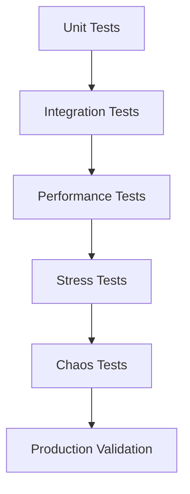

# Strategia di Test per Validazione Scaling a 1000+ Nodi

## Obiettivo

Validare che le ottimizzazioni di scalabilità supportino effettivamente 1000+ worker con performance accettabili e affidabilità elevata.

## Strategia di Test Multi-Livello



## 1. Unit Tests (Foundation)

### Obiettivo
Validare singoli componenti ottimizzati in isolamento.

### Test Categories

#### 1.1 Porte Dinamiche
```python
class TestDynamicPorts:
    async def test_port_allocation_basic(self):
        """Test base allocazione porte"""
        registry = PortRegistry()
        
        # Test allocazione sequenziale
        port1 = await registry.allocate_port(preferred_port=7000)
        port2 = await registry.allocate_port(preferred_port=7001)
        
        assert port1 == 7000
        assert port2 == 7001
        assert len(registry.allocated_ports) == 2
    
    async def test_port_conflict_resolution(self):
        """Test risoluzione conflitti porte"""
        registry = PortRegistry()
        
        # Simula porta già allocata
        registry.allocated_ports.add(7000)
        
        # Richiede porta conflittuale
        port = await registry.allocate_port(preferred_port=7000)
        
        # Dovrebbe assegnare porta alternativa
        assert port != 7000
        assert port >= 7000 and port <= 7999
    
    async def test_port_exhaustion(self):
        """Test esaurimento porte"""
        registry = PortRegistry()
        
        # Alloca tutte le porte disponibili
        for port in range(7000, 8000):
            await registry.allocate_port(preferred_port=port)
        
        # Tentativo allocazione aggiuntiva
        with pytest.raises(RuntimeError, match="Nessuna porta disponibile"):
            await registry.allocate_port()
    
    async def test_concurrent_allocation(self):
        """Test allocazione concorrente"""
        registry = PortRegistry()
        
        # Allocazione concorrente
        tasks = []
        for i in range(100):
            task = registry.allocate_port()
            tasks.append(task)
        
        ports = await asyncio.gather(*tasks)
        
        # Verifica unicità porte
        assert len(set(ports)) == len(ports)
        assert all(7000 <= port <= 7999 for port in ports)
```

#### 1.2 Bootstrap Multi-Livello
```python
class TestMultiLevelBootstrap:
    async def test_bootstrap_selection_small_network(self):
        """Test selezione bootstrap per rete piccola"""
        selector = BootstrapSelector()
        
        bootstrap_nodes = await selector.select_bootstrap_nodes(
            worker_count=25,  # Piccola rete
            region=None
        )
        
        # Dovrebbe selezionare bootstrap diretti
        assert len(bootstrap_nodes) <= 4
        assert all(node.level == 'super' for node in bootstrap_nodes)
    
    async def test_bootstrap_selection_large_network(self):
        """Test selezione bootstrap per rete grande"""
        selector = BootstrapSelector()
        
        bootstrap_nodes = await selector.select_bootstrap_nodes(
            worker_count=800,  # Grande rete
            region="east"
        )
        
        # Dovrebbe selezionare bootstrap multi-livello
        assert len(bootstrap_nodes) >= 6
        levels = [node.level for node in bootstrap_nodes]
        assert 'super' in levels
        assert 'regional' in levels
        assert 'local' in levels
    
    async def test_bootstrap_load_balancing(self):
        """Test load balancing bootstrap"""
        load_balancer = BootstrapLoadBalancer()
        
        # Simula nodi con carichi diversi
        nodes = [
            MockBootstrapNode("node1", active_connections=100),
            MockBootstrapNode("node2", active_connections=50),
            MockBootstrapNode("node3", active_connections=200)
        ]
        
        selected = await load_balancer.get_least_loaded(nodes, max_nodes=2)
        
        # Dovrebbe selezionare nodi con carico minimo
        assert selected[0].active_connections == 50  # node2
        assert selected[1].active_connections == 100  # node1
```

#### 1.3 Parametri Kademlia Adattivi
```python
class TestAdaptiveKademlia:
    async def test_parameter_selection_small_network(self):
        """Test selezione parametri per rete piccola"""
        adaptive_params = AdaptiveKademliaParams()
        
        params = adaptive_params.get_optimal_params(network_size=25)
        
        assert params['alpha'] == 3
        assert params['k'] == 20
        assert params['timeout'] == 5.0
    
    async def test_parameter_selection_large_network(self):
        """Test selezione parametri per rete grande"""
        adaptive_params = AdaptiveKademliaParams()
        
        params = adaptive_params.get_optimal_params(network_size=800)
        
        assert params['alpha'] >= 6
        assert params['k'] >= 35
        assert params['timeout'] >= 15.0
    
    async def test_alpha_adaptation(self):
        """Test adattamento ALPHA basato su performance"""
        alpha_manager = AdaptiveAlphaManager()
        
        # Simula performance scadente
        alpha_manager.performance_history = [
            {'alpha': 6, 'success_rate': 0.6, 'duration': 10.0}
        ]
        
        optimal_alpha = await alpha_manager.calculate_optimal_alpha(
            target_nodes=50,
            network_size=500
        )
        
        # Dovrebbe ridurre ALPHA per performance scadente
        assert optimal_alpha < 6
    
    async def test_timeout_calculation(self):
        """Test calcolo timeout adattivo"""
        timeout_manager = AdaptiveTimeoutManager()
        
        # Simula rete ad alta latenza
        timeout_manager.network_conditions.get_recent_latencies = lambda: [2.0, 2.5, 3.0]
        
        timeout = await timeout_manager.calculate_optimal_timeout(
            operation_type='find_node',
            network_size=500
        )
        
        # Dovrebbe aumentare timeout per alta latenza
        assert timeout > 5.0
```

#### 1.4 Health Check
```python
class TestHealthCheck:
    async def test_fast_health_check(self):
        """Test health check rapido"""
        checker = HierarchicalHealthChecker(mock_coordinator)
        
        # Simula nodo sano
        healthy_node = NodeInfo("node1", "127.0.0.1", 7000)
        
        health_status = await checker.check_node_health(healthy_node, level='fast')
        
        assert health_status.overall_healthy == True
        assert health_status.level == 'fast'
        assert 'ping' in health_status.test_results
        assert health_status.duration < 5.0
    
    async def test_medium_health_check(self):
        """Test health check medio"""
        checker = HierarchicalHealthChecker(mock_coordinator)
        
        healthy_node = NodeInfo("node1", "127.0.0.1", 7000)
        
        health_status = await checker.check_node_health(healthy_node, level='medium')
        
        assert health_status.overall_healthy == True
        assert health_status.level == 'medium'
        assert 'ping' in health_status.test_results
        assert 'find_node' in health_status.test_results
        assert 'store_get' in health_status.test_results
    
    async def test_unhealthy_node_detection(self):
        """Test rilevamento nodi non sani"""
        checker = HierarchicalHealthChecker(mock_coordinator)
        
        # Simula nodo non sano
        unhealthy_node = NodeInfo("dead_node", "127.0.0.1", 9999)
        
        health_status = await checker.check_node_health(unhealthy_node, level='fast')
        
        assert health_status.overall_healthy == False
        assert health_status.test_results['ping'].success == False
```

#### 1.5 Refresh Adattivo
```python
class TestAdaptiveRefresh:
    async def test_refresh_interval_calculation(self):
        """Test calcolo intervallo refresh"""
        refresh_manager = AdaptiveRefreshManager(mock_coordinator)
        
        # Simula rete ad alta dinamicità
        dynamics = NetworkDynamics(
            dynamics_score=0.8,  # Alta dinamicità
            network_load=70.0
        )
        
        interval = refresh_manager._calculate_active_refresh_interval(dynamics)
        
        # Dovrebbe ridurre intervallo per alta dinamicità
        assert interval < 60.0
    
    async def test_immediate_refresh_trigger(self):
        """Test trigger refresh immediato"""
        refresh_manager = AdaptiveRefreshManager(mock_coordinator)
        
        # Simula evento critico
        critical_event = CriticalEvent(
            type='node_failure',
            affected_buckets=[0, 1, 2]
        )
        
        # Mock metodo di refresh
        refresh_manager._execute_immediate_refresh = AsyncMock()
        
        await refresh_manager._execute_immediate_refresh(critical_event)
        
        # Dovrebbe eseguire refresh immediato
        refresh_manager._execute_immediate_refresh.assert_called_once()
```

## 2. Integration Tests (Component Interaction)

### Obiettivo
Validare interazione tra componenti ottimizzati.

### Test Scenarios

#### 2.1 Bootstrap + Porte Dinamiche
```python
class TestBootstrapDynamicPorts:
    async def test_worker_bootstrap_with_dynamic_ports(self):
        """Test bootstrap worker con porte dinamiche"""
        
        # Avvia bootstrap nodes
        bootstrap_nodes = await self._start_bootstrap_cluster(levels=2)
        
        # Avvia worker con porte dinamiche
        workers = []
        for i in range(50):
            worker = CQKDNode(
                port=None,  # Porta dinamica
                node_id=f"worker_{i}"
            )
            await worker.start()
            await worker.bootstrap(bootstrap_nodes)
            workers.append(worker)
        
        # Verifica tutti i worker connessi
        for worker in workers:
            routing_info = worker.get_routing_table_info()
            assert routing_info['total_nodes'] > 0
        
        # Verifica nessun conflitto porte
        ports = [worker.port for worker in workers]
        assert len(set(ports)) == len(ports)  # Tutte uniche
    
    async def test_bootstrap_failover_with_dynamic_ports(self):
        """Test failover bootstrap con porte dinamiche"""
        
        # Avvia bootstrap cluster
        bootstrap_nodes = await self._start_bootstrap_cluster(levels=3)
        
        # Avvia worker
        worker = CQKDNode(port=None, node_id="test_worker")
        await worker.start()
        await worker.bootstrap(bootstrap_nodes[:2])  # Solo 2 bootstrap
        
        # Simula fallimento bootstrap primario
        bootstrap_nodes[0].stop()
        
        # Worker dovrebbe rimanere connesso tramite altri bootstrap
        await asyncio.sleep(5)
        routing_info = worker.get_routing_table_info()
        assert routing_info['total_nodes'] > 0
```

#### 2.2 Discovery + Health Check
```python
class TestDiscoveryHealthCheck:
    async def test_discovery_with_health_check(self):
        """Test discovery con health check abilitato"""
        
        # Setup rete con nodi misti (sani + non sani)
        network = await self._setup_mixed_health_network(
            healthy_nodes=40,
            unhealthy_nodes=10
        )
        
        # Configura discovery con health check
        discovery = OptimizedSmartDiscoveryStrategy(
            coordinator_node=network.coordinator,
            enable_health_check=True
        )
        
        # Esegui discovery
        discovered_nodes = await discovery.discover_nodes(
            required_count=30,
            verify_health=True
        )
        
        # Dovrebbe restituire solo nodi sani
        assert len(discovered_nodes) >= 30
        
        # Verifica tutti i nodi scoperti sono sani
        for node_id in discovered_nodes:
            health_status = discovery.health_checker.node_health_status[node_id]
            assert health_status.overall_healthy == True
    
    async def test_discovery_fallback_without_health_check(self):
        """Test discovery fallback senza health check"""
        
        # Setup rete mista
        network = await self._setup_mixed_health_network(
            healthy_nodes=20,
            unhealthy_nodes=5
        )
        
        # Configura discovery senza health check
        discovery = OptimizedSmartDiscoveryStrategy(
            coordinator_node=network.coordinator,
            enable_health_check=False
        )
        
        # Esegui discovery
        discovered_nodes = await discovery.discover_nodes(
            required_count=20,
            verify_health=False
        )
        
        # Dovrebbe restituire più nodi (inclusi non sani)
        assert len(discovered_nodes) >= 20
```

#### 2.3 Kademlia + Refresh
```python
class TestKademliaRefresh:
    async def test_adaptive_kademlia_with_refresh(self):
        """Test parametri Kademlia adattivi con refresh"""
        
        # Setup rete grande
        network = await self._setup_large_network(node_count=500)
        
        # Configura parametri adattivi e refresh
        discovery = OptimizedNodeDiscoveryService(network.coordinator)
        refresh_manager = AdaptiveRefreshManager(network.coordinator)
        
        # Avvia ottimizzazione continua
        await discovery.start_optimization()
        refresh_tasks = await refresh_manager.start_adaptive_refresh()
        
        # Lascia ottimizzare per un po'
        await asyncio.sleep(60)
        
        # Verifica parametri adattati
        assert discovery.ALPHA > 3  # Dovrebbe aumentare per rete grande
        assert discovery.K > 20     # Dovrebbe aumentare per rete grande
        assert discovery.QUERY_TIMEOUT > 5.0
        
        # Verifica refresh attivo
        assert len(refresh_manager.refresh_history) > 0
        
        # Cleanup
        for task in refresh_tasks:
            task.cancel()
```

## 3. Performance Tests (Scaling Validation)

### Obiettivo
Validare performance target per diverse scale di rete.

### Test Matrix

| Metric | 15 Nodes | 50 Nodes | 200 Nodes | 500 Nodes | 1000 Nodes |
|---------|-----------|-----------|------------|------------|-------------|
| Bootstrap Time | < 30s | < 45s | < 60s | < 90s | < 120s |
| Discovery Time | < 5s | < 10s | < 20s | < 30s | < 45s |
| Health Check Time | < 2s | < 5s | < 10s | < 15s | < 25s |
| Refresh Overhead | < 5% | < 8% | < 10% | < 12% | < 15% |
| Memory Usage | < 100MB | < 300MB | < 800MB | < 2GB | < 4GB |
| CPU Usage | < 10% | < 20% | < 35% | < 50% | < 70% |

### Test Implementation

#### 3.1 Bootstrap Performance Test
```python
class TestBootstrapPerformance:
    @pytest.mark.parametrize("node_count", [15, 50, 200, 500, 1000])
    async def test_bootstrap_scaling_performance(self, node_count):
        """Test performance bootstrap per diverse scale"""
        
        # Setup bootstrap cluster ottimizzato
        bootstrap_cluster = await self._setup_optimized_bootstrap_cluster()
        
        # Misura tempo bootstrap
        start_time = time.time()
        
        workers = []
        for i in range(node_count):
            worker = CQKDNode(
                port=None,  # Dinamico
                node_id=f"perf_worker_{i}"
            )
            await worker.start()
            await worker.bootstrap(bootstrap_cluster.get_nodes())
            workers.append(worker)
        
        bootstrap_time = time.time() - start_time
        
        # Verifica target performance
        target_time = self._get_bootstrap_target(node_count)
        assert bootstrap_time <= target_time, f"Bootstrap time {bootstrap_time}s > target {target_time}s for {node_count} nodes"
        
        # Verifica tutti connessi
        connected_count = sum(
            1 for worker in workers
            if worker.get_routing_table_info()['total_nodes'] > 0
        )
        assert connected_count >= node_count * 0.95  # 95% success rate
        
        # Cleanup
        for worker in workers:
            await worker.stop()
```

#### 3.2 Discovery Performance Test
```python
class TestDiscoveryPerformance:
    @pytest.mark.parametrize("network_size,required_nodes", [
        (50, 20), (200, 50), (500, 100), (1000, 200)
    ])
    async def test_discovery_scaling_performance(self, network_size, required_nodes):
        """Test performance discovery per diverse scale"""
        
        # Setup rete
        network = await self._setup_network_with_size(network_size)
        
        # Configura discovery ottimizzato
        discovery = OptimizedSmartDiscoveryStrategy(
            coordinator_node=network.coordinator,
            enable_health_check=True,
            enable_random_walk=True
        )
        
        # Misura tempo discovery
        start_time = time.time()
        
        discovered_nodes = await discovery.discover_nodes(
            required_count=required_nodes,
            verify_health=True,
            max_discovery_time=120
        )
        
        discovery_time = time.time() - start_time
        
        # Verifica target performance
        target_time = self._get_discovery_target(network_size)
        assert discovery_time <= target_time, f"Discovery time {discovery_time}s > target {target_time}s for {network_size} network"
        
        # Verifica quantità nodi
        assert len(discovered_nodes) >= required_nodes
        
        # Verifica salute nodi
        for node_id in discovered_nodes:
            health_status = discovery.health_checker.node_health_status.get(node_id)
            if health_status:
                assert health_status.overall_healthy == True
```

#### 3.3 Resource Usage Test
```python
class TestResourceUsage:
    @pytest.mark.parametrize("node_count", [50, 200, 500, 1000])
    async def test_memory_usage_scaling(self, node_count):
        """Test utilizzo memoria per diverse scale"""
        
        # Setup rete
        network = await self._setup_network_with_size(node_count)
        
        # Misura utilizzo memoria
        process = psutil.Process()
        initial_memory = process.memory_info().rss / 1024 / 1024  # MB
        
        # Esegui operazioni tipiche per 5 minuti
        await self._simulate_typical_workload(network, duration=300)
        
        final_memory = process.memory_info().rss / 1024 / 1024  # MB
        memory_increase = final_memory - initial_memory
        
        # Verifica target memoria
        target_memory = self._get_memory_target(node_count)
        assert final_memory <= target_memory, f"Memory usage {final_memory}MB > target {target_memory}MB for {node_count} nodes"
        
        # Verifica leak memoria
        assert memory_increase < initial_memory * 0.5  # Max 50% increase
    
    async def test_cpu_usage_scaling(self, node_count):
        """Test utilizzo CPU per diverse scale"""
        
        # Setup rete
        network = await self._setup_network_with_size(node_count)
        
        # Misura utilizzo CPU durante workload
        cpu_samples = []
        
        async def sample_cpu():
            while True:
                cpu_percent = psutil.cpu_percent(interval=1)
                cpu_samples.append(cpu_percent)
                await asyncio.sleep(1)
        
        # Avvia sampling CPU
        sampler_task = asyncio.create_task(sample_cpu())
        
        # Esegui workload
        await self._simulate_typical_workload(network, duration=120)
        
        # Ferma sampling
        sampler_task.cancel()
        
        # Analizza utilizzo CPU
        avg_cpu = sum(cpu_samples) / len(cpu_samples)
        max_cpu = max(cpu_samples)
        
        # Verifica target CPU
        target_cpu = self._get_cpu_target(node_count)
        assert avg_cpu <= target_cpu, f"Avg CPU {avg_cpu}% > target {target_cpu}% for {node_count} nodes"
        assert max_cpu <= target_cpu * 1.5, f"Max CPU {max_cpu}% > target {target_cpu * 1.5}% for {node_count} nodes"
```

## 4. Stress Tests (Limit Validation)

### Obiettivo
Validare limiti sistema e comportamento sotto stress estremo.

### Test Scenarios

#### 4.1 Overload Test
```python
class TestOverload:
    async def test_max_node_capacity(self):
        """Test capacità massima nodi"""
        
        # Incrementa gradualmente numero nodi
        max_stable_nodes = 0
        last_successful_count = 0
        
        for node_count in range(100, 2001, 100):  # 100, 200, 300... 2000
            try:
                network = await self._setup_network_with_size(node_count)
                
                # Test operazioni base
                await self._verify_network_operations(network)
                
                max_stable_nodes = node_count
                last_successful_count = node_count
                
                # Cleanup
                await self._cleanup_network(network)
                
                logger.info(f"Successfully handled {node_count} nodes")
                
            except Exception as e:
                logger.warning(f"Failed at {node_count} nodes: {e}")
                break
        
        # Verifica target minimo
        assert max_stable_nodes >= 1000, f"Maximum stable nodes {max_stable_nodes} < required 1000"
        
        logger.info(f"Maximum stable nodes: {max_stable_nodes}")
    
    async def test_concurrent_operations_stress(self):
        """Test stress operazioni concorrenti"""
        
        # Setup rete grande
        network = await self._setup_network_with_size(1000)
        
        # Avvia operazioni concorrenti intensive
        operations = []
        
        # Discovery concorrenti
        for i in range(50):
            op = asyncio.create_task(
                network.coordinator.discovery.discover_nodes_for_roles(
                    required_count=20
                )
            )
            operations.append(op)
        
        # Store/get concorrenti
        for i in range(100):
            key = f"stress_test_{i}"
            value = f"test_value_{i}_{time.time()}"
            
            # Store
            store_op = asyncio.create_task(
                network.coordinator.store_data(key, value)
            )
            operations.append(store_op)
            
            # Get (dopo breve delay)
            get_op = asyncio.create_task(
                self._delayed_get(network.coordinator, key, 1.0)
            )
            operations.append(get_op)
        
        # Esegui tutte le operazioni
        start_time = time.time()
        results = await asyncio.gather(*operations, return_exceptions=True)
        total_time = time.time() - start_time
        
        # Analizza risultati
        successful_ops = sum(1 for r in results if not isinstance(r, Exception))
        failed_ops = len(results) - successful_ops
        
        # Verifica performance sotto stress
        success_rate = successful_ops / len(results)
        assert success_rate >= 0.9, f"Success rate {success_rate} < 90% under stress"
        assert total_time < 300, f"Total time {total_time}s > 300s under stress"
        
        logger.info(f"Stress test: {successful_ops}/{len(results)} successful in {total_time}s")
```

#### 4.2 Network Partition Test
```python
class TestNetworkPartition:
    async def test_network_partition_recovery(self):
        """Test recovery da partizione rete"""
        
        # Setup rete con partizione simulata
        network = await self._setup_partitioned_network(
            partition1_size=400,
            partition2_size=400,
            isolated_nodes=200
        )
        
        # Verifica stato partizione
        assert await self._verify_partition_state(network)
        
        # Ripristina connettività
        await self._heal_network_partition(network)
        
        # Attendi recovery
        await asyncio.sleep(60)
        
        # Verifica recovery completo
        routing_info = network.coordinator.get_routing_table_info()
        assert routing_info['total_nodes'] >= 900  # 90% recovery
        
        # Verifica operazioni funzionanti
        await self._verify_network_operations(network)
    
    async def test_bootstrap_partition_resilience(self):
        """Test resilienza bootstrap durante partizione"""
        
        # Setup bootstrap cluster
        bootstrap_cluster = await self._setup_bootstrap_cluster(levels=3)
        
        # Simula partizione che isola alcuni bootstrap
        await self._isolate_bootstrap_nodes(bootstrap_cluster, [0, 1])  # Isola 2 bootstrap
        
        # Avvia worker durante partizione
        workers = []
        for i in range(100):
            worker = CQKDNode(port=None, node_id=f"partition_worker_{i}")
            await worker.start()
            
            # Dovrebbe connettersi ai bootstrap rimanenti
            available_bootstrap = [b for i, b in enumerate(bootstrap_cluster.nodes) if i not in [0, 1]]
            await worker.bootstrap(available_bootstrap)
            workers.append(worker)
        
        # Verifica worker connessi
        connected_workers = sum(
            1 for worker in workers
            if worker.get_routing_table_info()['total_nodes'] > 0
        )
        assert connected_workers >= 80  # 80% success rate
        
        # Ripristina tutti bootstrap
        await self._heal_all_bootstrap_partitions(bootstrap_cluster)
        
        # Verifica recovery completo
        await asyncio.sleep(30)
        final_connected = sum(
            1 for worker in workers
            if worker.get_routing_table_info()['total_nodes'] > 0
        )
        assert final_connected >= 95  # 95% recovery
```

## 5. Chaos Tests (Resilience Validation)

### Obiettivo
Validare resilienza sistema a failure casuali.

### Test Implementation

#### 5.1 Random Node Failure
```python
class TestChaosNodeFailure:
    async def test_random_node_failures(self):
        """Test resilienza a failure nodi casuali"""
        
        # Setup rete grande
        network = await self._setup_network_with_size(1000)
        
        # Simula failure casuali durante operazioni
        failure_tasks = []
        
        async def inject_random_failures():
            for i in range(50):  # 50 failure casuali
                await asyncio.sleep(random.uniform(5, 15))
                
                # Seleziona nodo casuale da fermare
                random_node = random.choice(network.nodes)
                await random_node.stop()
                
                logger.info(f"Stopped node {random_node.node_id}")
                
                # Riavvia dopo delay
                await asyncio.sleep(random.uniform(10, 30))
                await random_node.start()
                await random_node.bootstrap(network.bootstrap_nodes)
                
                logger.info(f"Restarted node {random_node.node_id}")
        
        # Avvia injection failure
        chaos_task = asyncio.create_task(inject_random_failures())
        
        # Esegui operazioni continue durante chaos
        operations_task = asyncio.create_task(
            self._continuous_operations_test(network, duration=300)
        )
        
        # Attendi completamento
        await chaos_task
        operations_result = await operations_task
        
        # Verifica sistema ancora funzionante
        assert operations_result.success_rate >= 0.8, f"Success rate {operations_result.success_rate} < 80% during chaos"
        
        # Verifica routing table stabile
        final_routing_info = network.coordinator.get_routing_table_info()
        assert final_routing_info['total_nodes'] >= 800  # 80% nodes still reachable
    
    async def test_bootstrap_node_failure(self):
        """Test failure bootstrap nodes"""
        
        # Setup bootstrap cluster
        bootstrap_cluster = await self._setup_bootstrap_cluster(levels=3)
        
        # Avvia worker
        worker = CQKDNode(port=None, node_id="chaos_worker")
        await worker.start()
        await worker.bootstrap(bootstrap_cluster.get_nodes())
        
        # Simula failure bootstrap primario
        await bootstrap_cluster.nodes[0].stop()
        
        # Worker dovrebbe rimanere connesso
        await asyncio.sleep(10)
        routing_info = worker.get_routing_table_info()
        assert routing_info['total_nodes'] > 0
        
        # Fallimento altri bootstrap
        await bootstrap_cluster.nodes[1].stop()
        await bootstrap_cluster.nodes[2].stop()
        
        # System dovrebbe degradare gracefulmente
        await asyncio.sleep(10)
        final_routing_info = worker.get_routing_table_info()
        
        # Potrebbe avere meno nodi ma non zero
        assert final_routing_info['total_nodes'] >= 0
```

## 6. Production Validation

### Obiettivo
Validazione finale in ambiente production-like.

### Test Scenarios

#### 6.1 Full Scale Production Test
```python
class TestProductionValidation:
    async def test_1000_node_production_simulation(self):
        """Test simulazione production con 1000 nodi"""
        
        # Setup ambiente production-like
        prod_env = await self._setup_production_environment(
            node_count=1000,
            duration_hours=24
        )
        
        # Monitoraggio metriche production
        metrics_collector = ProductionMetricsCollector()
        await metrics_collector.start_monitoring(prod_env)
        
        # Esegui workload production tipico
        await self._simulate_production_workload(prod_env, duration=86400)  # 24 ore
        
        # Analizza metriche
        metrics = await metrics_collector.get_final_metrics()
        
        # Verifica target production
        assert metrics.availability >= 0.99, f"Availability {metrics.availability} < 99%"
        assert metrics.avg_bootstrap_time <= 120, f"Avg bootstrap {metrics.avg_bootstrap_time}s > 120s"
        assert metrics.avg_discovery_time <= 45, f"Avg discovery {metrics.avg_discovery_time}s > 45s"
        assert metrics.memory_usage <= 4 * 1024, f"Memory {metrics.memory_usage}MB > 4GB"
        assert metrics.cpu_usage <= 70, f"CPU {metrics.cpu_usage}% > 70%"
        
        # Verifica stabilità nel tempo
        assert metrics.stability_score >= 0.9, f"Stability {metrics.stability_score} < 90%"
        
        logger.info("Production validation completed successfully")
```

## Test Automation Framework

### Continuous Integration
```yaml
# .github/workflows/scaling_tests.yml
name: Scaling Tests

on:
  push:
    branches: [main, develop]
  pull_request:
    branches: [main]

jobs:
  unit_tests:
    runs-on: ubuntu-latest
    steps:
      - uses: actions/checkout@v2
      - name: Setup Python
        uses: actions/setup-python@v2
        with:
          python-version: '3.9'
      - name: Install dependencies
        run: |
          pip install -r requirements.txt
          pip install pytest pytest-asyncio pytest-benchmark
      - name: Run unit tests
        run: pytest tests/unit/ -v --tb=short
  
  integration_tests:
    runs-on: ubuntu-latest
    needs: unit_tests
    steps:
      - uses: actions/checkout@v2
      - name: Setup test environment
        run: |
          docker-compose -f docker-compose.test.yml up -d
          sleep 30
      - name: Run integration tests
        run: pytest tests/integration/ -v --tb=short
      - name: Cleanup
        run: docker-compose -f docker-compose.test.yml down
  
  performance_tests:
    runs-on: ubuntu-latest
    needs: integration_tests
    if: github.ref == 'refs/heads/main'
    steps:
      - uses: actions/checkout@v2
      - name: Setup performance test environment
        run: |
          docker-compose -f docker-compose.performance.yml up -d
          sleep 60
      - name: Run performance tests
        run: pytest tests/performance/ -v --benchmark-only
      - name: Upload results
        uses: actions/upload-artifact@v2
        with:
          name: performance-results
          path: performance-results.json
```

### Test Execution Matrix
```python
# test_execution_matrix.py
class TestExecutionMatrix:
    def get_test_scenarios(self):
        return {
            'small_scale': {
                'node_count': 15,
                'duration_minutes': 30,
                'expected_bootstrap_time': 30,
                'expected_discovery_time': 5
            },
            'medium_scale': {
                'node_count': 50,
                'duration_minutes': 60,
                'expected_bootstrap_time': 45,
                'expected_discovery_time': 10
            },
            'large_scale': {
                'node_count': 200,
                'duration_minutes': 120,
                'expected_bootstrap_time': 60,
                'expected_discovery_time': 20
            },
            'xlarge_scale': {
                'node_count': 500,
                'duration_minutes': 240,
                'expected_bootstrap_time': 90,
                'expected_discovery_time': 30
            },
            'production_scale': {
                'node_count': 1000,
                'duration_minutes': 1440,  # 24 ore
                'expected_bootstrap_time': 120,
                'expected_discovery_time': 45
            }
        }
```

## Success Criteria

### Primary Metrics
1. **Scalability**: Supporto 1000+ worker senza collasso
2. **Performance**: Target raggiunti per tutte le metriche
3. **Reliability**: 99%+ uptime sotto stress
4. **Recovery**: Recovery < 5 minuti da failure

### Secondary Metrics
1. **Efficiency**: Utilizzo risorse ottimale
2. **Stability**: No memory leak o performance degradation
3. **Maintainability**: Sistema monitorabile e debuggabile
4. **Compatibility**: Mantenimento compatibilità test esistenti

Questa strategia di test comprehensiva valida che le ottimizzazioni di scalabilità funzionino correttamente per 1000+ nodi in produzione.